## Aktueller Pfad - pwd (print working directory)

## Shell anzeigen - echo $SHELL

## First Script
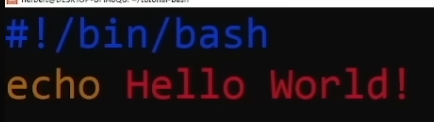
## Script ausführbar machen
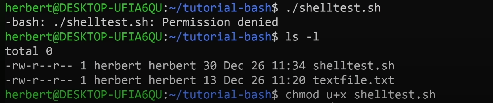
## Beispiel Variablen
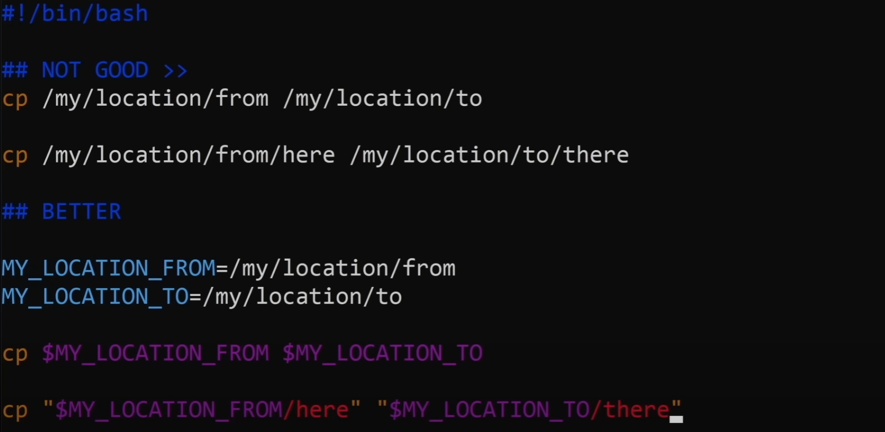
---

---
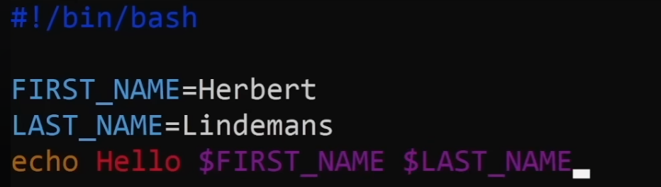
---
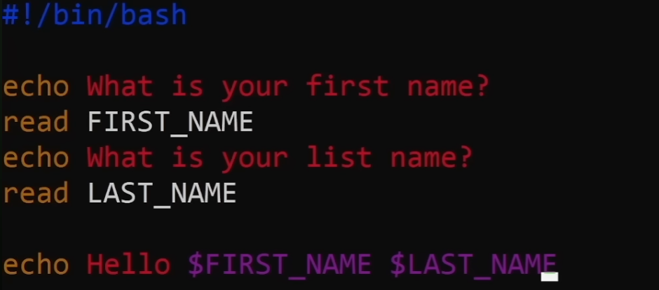
---

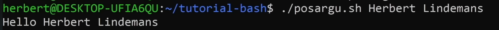
## Pipe (|)
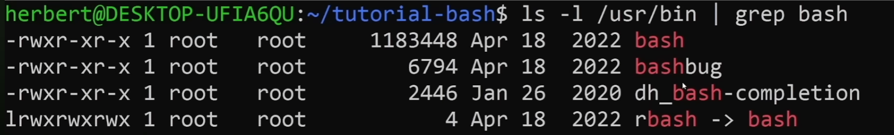
## Input/Output
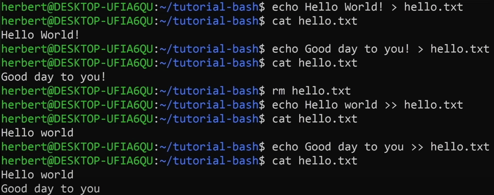
---
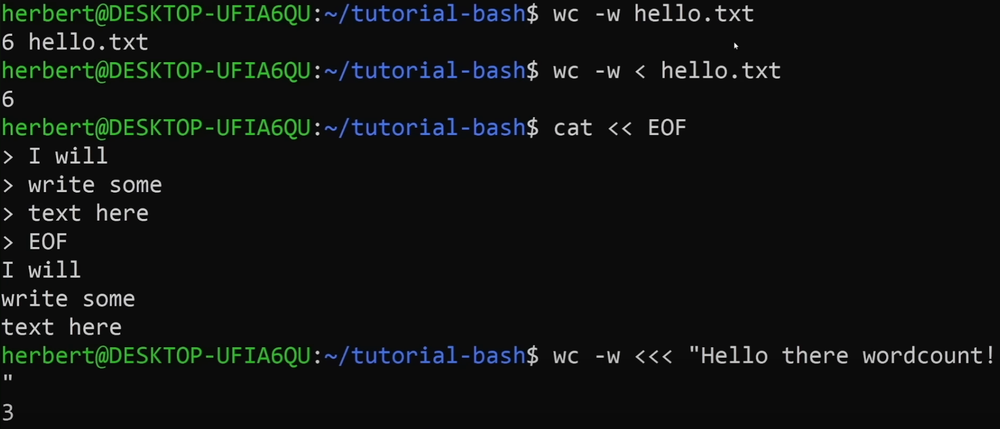
## Test operators
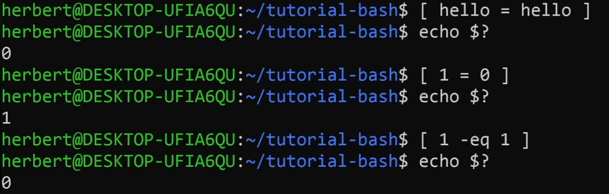
## If/else/elif
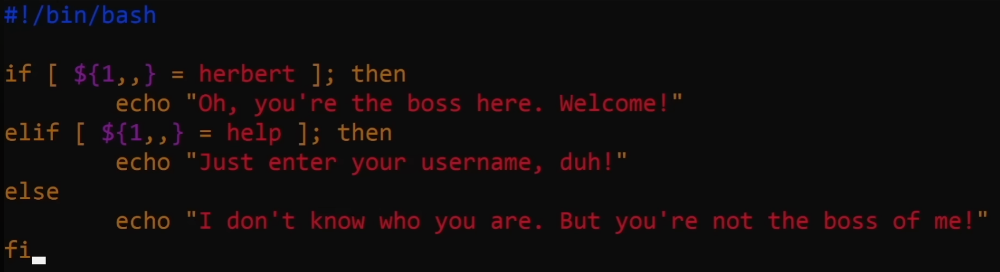
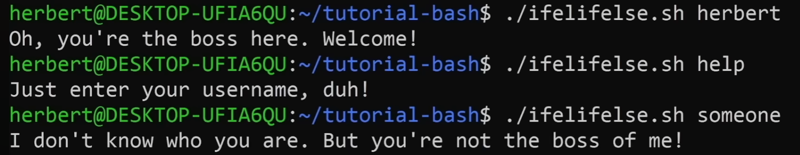
# Case
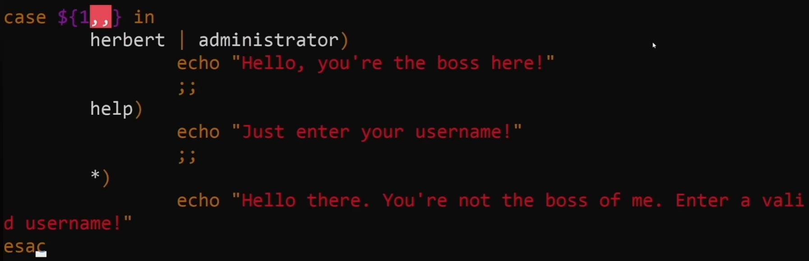

## Array
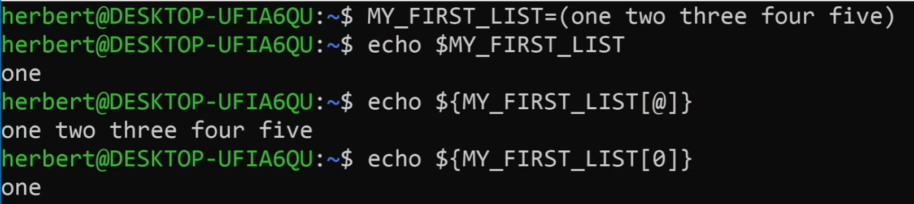
## For Schleife

## Funktionen
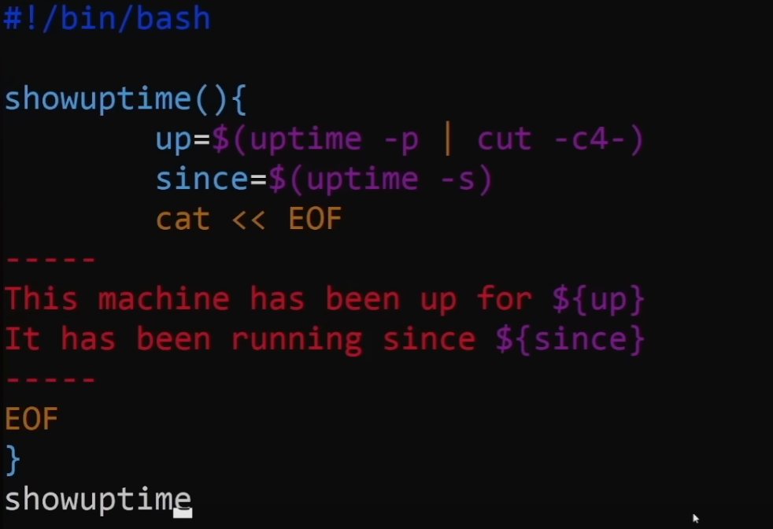
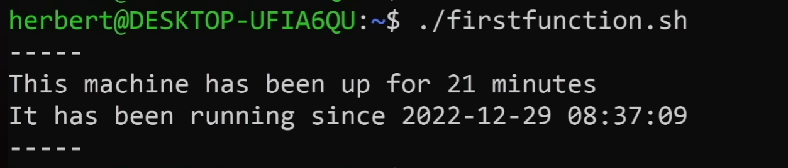